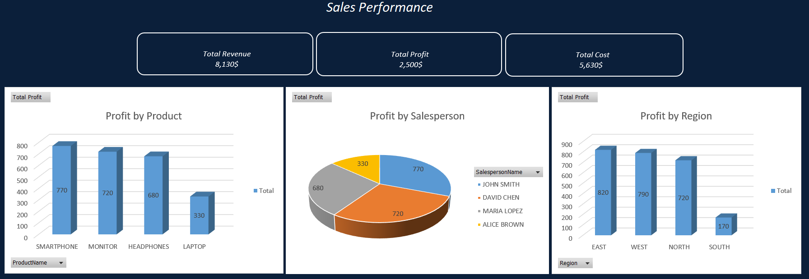

# Excel-Sales-Dashboard

**Introduction**

This project is an Excel-based sales performance dashboard built for a fictional retail company.  
It demonstrates end-to-end Excel BI skills including data cleaning, modeling, and reporting.

This was my first Excel BI project. The dataset is small and fictional, but the workflow is designed to mirror a real-world data analyst process — from messy data cleaning through to dashboard visualization.

**Skills used**

.Excel
.Power Querry: Data cleaning and transformation

.Power Pivot: Data modeling

.DAX: Creating KPIs and measures

.Pivot Tables:Data analysis and conclusions

.Dashboard design and visualization

**Business Goals**

- Provide a clear view of overall sales performance and profitability.
- Identify top-performing products, salespeople, and regions.
- Deliver a dashboard that supports management decision-making.

**Data Preparation & Modeling**

- Three datasets were provided (All Data, Product Data, Salesperson Data), the three datasets were loaded into three separate Excel sheets in the same workbook.
  
- The main dataset (All Data) was loaded into Power Query.
  
- The dataset was cleaned and transformed to make it analysis-ready (corrected column headers, fixed data types, trimmed extra spaces, applied consistent uppercase            formatting, removed errors and blank rows, and removed unnecessary columns).
  
- The cleaned All Data table was added to the Data Model as a connection.
  
- The same cleaning steps were applied to the Product Data and Salesperson Data tables.
  
- The cleaned data is now ready to be used in Power Pivot.
  
- Using Power Pivot (Diagram View), the required relationships were created:
  
- Four additional calculated columns were created in the All Data table in Power Pivot:
  - RevenuePerOrder
  - CostPerOrder
  - ProfitPerOrder
  - SalesPersonName
    
- Four DAX measures were created:
  - Total Revenue
  - Total Cost
  - Total Profit
  - Total Quantity Sold
    
- Four PivotTables were created using the Data Model:
  1. Total: shows Total Revenue, Total Cost, and Total Profit
  2. Best Salesperson: ranks salespeople by profit (descending)
  3. Best Product: ranks products by profit (descending)
  4. Best Region: ranks regions by profit (descending)
     
- A dashboard with three charts and the main KPIs was created using the PivotTables:
  - Profit by Product
  - Profit by Salesperson
  - Profit by Region
  - 

**Dashboard Insights**

- The dashboard provides a clear overview of overall sales performance and profitability.
- The **most profitable products** are highlighted, showing which products generate the highest profit.
- The **top salespeople** are ranked based on profit contribution, allowing management to identify strong performers.
- The **regional performance** analysis highlights which regions contribute the most to profitability.
- The KPI section shows total revenue, total cost, total profit, and total quantity sold, providing quick insights for decision-making.

**Dashboard Preview**

